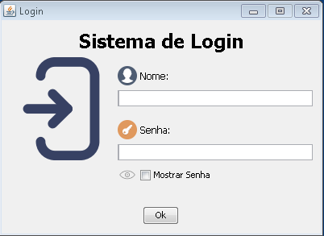

<h1 align="center">
  <h1 align="center">Sistema Login</h1>
</h1>

<h4 align="center">
  Login screen project in Java GUI, without database (for now).
</h4>

<p align="center">
  <a href="#Built with">Built with</a>&nbsp;&nbsp;&nbsp;|&nbsp;&nbsp;&nbsp;
  <a href="#how-to-run">How to run</a>&nbsp;&nbsp;&nbsp;|&nbsp;&nbsp;&nbsp;
  <a href="#Screen">ScreenShots</a>&nbsp;&nbsp;&nbsp;|&nbsp;&nbsp;&nbsp;
  <a href="#access">Access</a>&nbsp;&nbsp;&nbsp;
</p>
<br><br>

<h2 id="Built with">:pencil2: Built with</h2>

This project was built with prototype technologies:

- Java
- Java GUI

<h2 id="how-to-run">:computer: How to run</h2>

```bash
# to clone the repository
git clone https://github.com/YujiYashima/SistemaLogin.git
```
Or download the folder and open this project in you IDE java.

<h2 id="Screen">:camera: ScreenShots</h2>

<h3 align="center">
  
</h3>

<h2 id="access">:unlock: Access :key:</h2>

To access the screen, use the following parameters within the login screen:

- USER: "usuario"
- KEY: "1234"
